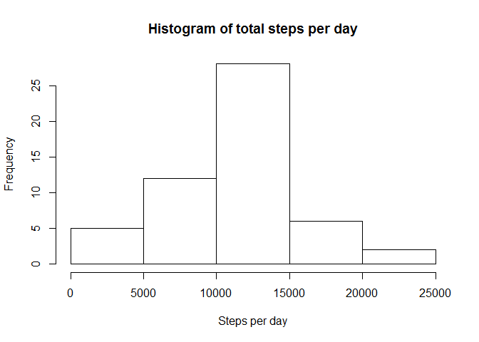
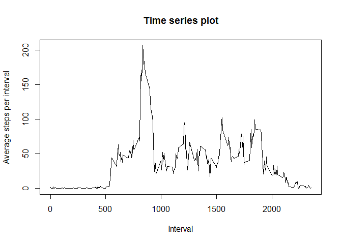
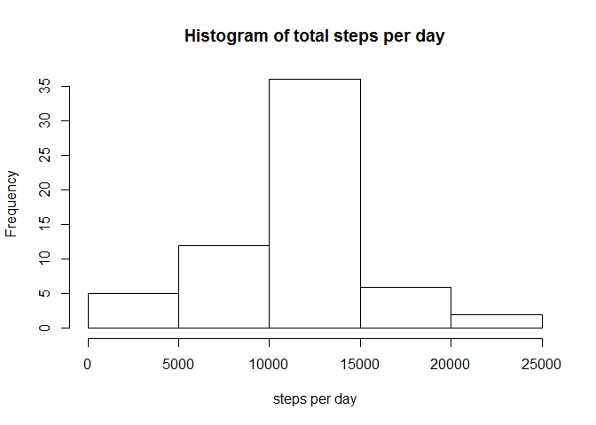
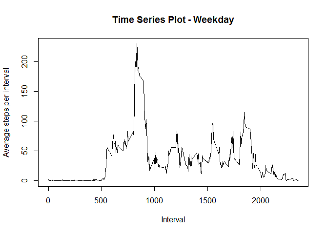
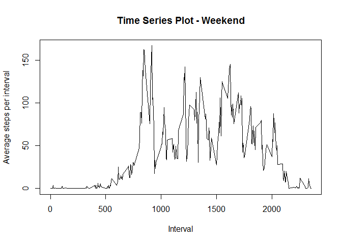

# Reproducible Research: Peer Assessment 1


## Loading and preprocessing the data
First, set your own working directory with setwd() where data activity.zip file exists.
Next, unzip and read activity data.

```r
data = read.csv(unz("activity.zip", "activity.csv"), header = TRUE)
```
Then, changing date column data into date.

```r
data$date <- as.Date(data$date)
```

## What is mean total number of steps taken per day?
Aggregating data by steps per day.

```r
dataAgg <- aggregate(steps~date,data=data, FUN = "sum")
```
Drawing a histogram for aggregated data.

```r
hist(dataAgg$steps, main="Histogram of total steps per day",xlab="Steps per day")
```

 

Calculating mean.

```r
meanSteps <- mean(dataAgg$steps)
meanSteps
```

```
## [1] 10766.19
```
Calculating median.

```r
medianSteps <- median(dataAgg$steps)
meanSteps
```

```
## [1] 10766.19
```

## What is the average daily activity pattern?
Calculating average for time interval.

```r
dataInterval <- aggregate(steps~interval,data=data, FUN = "mean")
```
Drawing time series plot.

```r
plot(dataInterval$interval, dataInterval$steps, type="l", main="Time series plot", xlab="Interval", ylab="Average steps per interval")
```

 

Calculating max averagesteps.

```r
maxSteps <- dataInterval[dataInterval$steps==max(dataInterval$steps),"interval"]
maxSteps
```

```
## [1] 835
```

## Imputing missing values
Calculating missing data.

```r
missingValues <- sum(is.na(data$steps))
missingValues
```

```
## [1] 2304
```
Creating function for filling missing values. Then, applying this to original data set and creating new one. And aggregating data for new dat set.

```r
library(plyr)
MeanFunction <- function(x) replace(x, is.na(x), mean(x, na.rm = TRUE))
dataImputed <- ddply(data, ~interval, transform, steps = MeanFunction(steps))
dataImputedAgg <- aggregate(steps~date,data=dataImputed, FUN = "sum")
```
Drawing histogram with imputed data.

```r
hist(dataImputedAgg$steps, main="Histogram of total steps per day",xlab="steps per day")
```

 

Calculating mean.

```r
meanStepsImp <- mean(dataImputedAgg$steps)
meanStepsImp
```

```
## [1] 10766.19
```
Calculating median.

```r
medianStepsImp <- median(dataImputedAgg$steps)
medianStepsImp
```

```
## [1] 10766.19
```

## Are there differences in activity patterns between weekdays and weekends?
Determine weekday. Also setting locale to english.

```r
Sys.setlocale("LC_ALL","English")
```

```
## [1] "LC_COLLATE=English_United States.1252;LC_CTYPE=English_United States.1252;LC_MONETARY=English_United States.1252;LC_NUMERIC=C;LC_TIME=English_United States.1252"
```

```r
dataImputed$day <- weekdays(dataImputed$date)
```
Weekday data

```r
dataIntervalWeekday <- aggregate(steps~interval,data=subset(dataImputed, day %in% c("Monday","Tuesday", "Wednesday", "Thursday", "Friday")), FUN = "mean")
```
Weekend data.

```r
dataIntervalWeekend <- aggregate(steps~interval,data=subset(dataImputed, day %in% c("Saturday","Sunday")), FUN = "mean")
```
The following time series plots display the weekday and weekend data separately.

```r
plot(dataIntervalWeekday$interval, dataIntervalWeekday$steps, type="l", main="Time Series Plot - Weekday", xlab="Interval", ylab="Average steps per interval")
```

 

```r
plot(dataIntervalWeekend$interval, dataIntervalWeekend$steps, type="l", main="Time Series Plot - Weekend", xlab="Interval", ylab="Average steps per interval")
```

 
